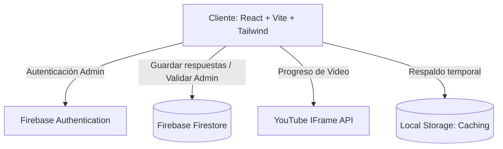

# 📚 Manual Técnico y Metodológico: Estudio Académico IA

Este documento detalla la arquitectura de software, el diseño metodológico de las variables y el esquema de base de datos de la plataforma web del cuestionario académico.

---

## 1. Arquitectura de Software

La aplicación está construida sobre una arquitectura **Servidor-Cliente Jamstack**, optimizando el rendimiento, la seguridad y la facilidad de despliegue.



### Componentes de la Arquitectura:
- **Frontend (UI/UX):** React 19 con empaquetado ultra-rápido usando **Vite.js**.
- **Motor de Estilos:** **Tailwind CSS v4.0** implementando un sistema de diseño minimalista con modo claro/oscuro adaptado a la fatiga visual.
- **Gestión de Animaciones:** **Framer Motion** para transiciones fluidas de las tarjetas Likert.
- **Backend / Persistencia:** **Firebase Firestore** para sincronización en tiempo real y **Firebase Authentication** para el acceso de administradores.
- **Integración Multimedia:** **YouTube IFrame Player API** para control y verificación de la reproducción del video instructivo.

---

## 2. Diseño Metodológico y Variables

El cuestionario mide la interacción de dos variables principales a través de un diseño experimental/cuasi-experimental de tipo **Pretest / Posttest**:

### 📊 Operativización de Variables

| Variable | Dimensión | Código Ítems | Escala Likert |
| :--- | :--- | :--- | :--- |
| **V1: IA Generativa** | ChatGPT | `chatgpt_q1` - `chatgpt_q3` | 1 (Totalmente en desacuerdo) a 5 (Totalmente de acuerdo) |
| | Gemini | `gemini_q1` - `gemini_q3` | 1 (Totalmente en desacuerdo) a 5 (Totalmente de acuerdo) |
| | Copilot | `copilot_q1` - `copilot_q3` | 1 (Totalmente en desacuerdo) a 5 (Totalmente de acuerdo) |
| **V2: Efectividad del Aprendizaje** | Comprensión | `comprension_q1` - `comprension_q5` | 1 (Totalmente en desacuerdo) a 5 (Totalmente de acuerdo) |
| | Creatividad | `creatividad_q1` - `creatividad_q5` | 1 (Totalmente en desacuerdo) a 5 (Totalmente de acuerdo) |

### 🔍 Cálculo de Puntuaciones
En el panel del administrador, la puntuación de cada dimensión se calcula como la media de sus ítems asociados:
$$\text{Puntuación Dimensión} = \frac{\sum_{i=1}^{n} \text{Valor Ítem}_i}{n}$$
Donde $n$ es el número de preguntas de la dimensión (3 para herramientas, 5 para comprensión y creatividad). El dashboard calcula y grafica estos promedios de forma agregada para el **Pretest** y el **Posttest**, permitiendo analizar el impacto del video de capacitación.

---

## 3. Esquema de Base de Datos (Firestore)

El sistema utiliza bases de datos no relacionales estructuradas en dos colecciones en Firestore:

### A. Colección `survey_responses`
Almacena las encuestas completadas por los participantes.

```json
{
  "participantId": "String (Ej: IA-STUDY-A4B7D)",
  "demographics": {
    "age": "Number (Ej: 24)",
    "gender": "String (Masculino | Femenino | Otro)",
    "hasUsedAI": "String (yes | no)",
    "mostUsedTool": "String (ChatGPT | Gemini | Copilot | Ninguna)"
  },
  "pretest": {
    "chatgpt_q1": "Number (1-5)",
    "chatgpt_q2": "Number (1-5)",
    "chatgpt_q3": "Number (1-5)",
    "gemini_q1": "Number (1-5)",
    "gemini_q2": "Number (1-5)",
    "gemini_q3": "Number (1-5)",
    "copilot_q1": "Number (1-5)",
    "copilot_q2": "Number (1-5)",
    "copilot_q3": "Number (1-5)",
    "comprension_q1": "Number (1-5)",
    "comprension_q2": "Number (1-5)",
    "comprension_q3": "Number (1-5)",
    "comprension_q4": "Number (1-5)",
    "comprension_q5": "Number (1-5)",
    "creatividad_q1": "Number (1-5)",
    "creatividad_q2": "Number (1-5)",
    "creatividad_q3": "Number (1-5)",
    "creatividad_q4": "Number (1-5)",
    "creatividad_q5": "Number (1-5)"
  },
  "posttest": {
    "// ... mismas preguntas e id que el pretest con las respuestas posteriores"
  },
  "submittedAt": "Timestamp (Hora del Servidor)",
  "createdAt": "String (ISO Date de Creación en Cliente)",
  "systemInfo": {
    "userAgent": "String (Información del navegador)",
    "language": "String (Idioma del sistema)",
    "screenSize": "String (Ej: 1920x1080)"
  }
}
```

### B. Colección `admins`
Almacena los identificadores únicos (UID) de los usuarios que poseen rol de administrador.
```json
{
  "email": "String (Ej: admin@correo.com)",
  "role": "String (fijo: 'admin')",
  "createdAt": "String (ISO Date)"
}
```
*Nota: La regla de seguridad en Firestore debe permitir la lectura y escritura de este documento si el UID autenticado coincide con el ID del documento.*

---

## 4. Lógica de Control e Integraciones

### 🔞 Control Ético de Menores de Edad
En la vista [`ConsentForm.jsx`](file:///c:/Users/rober/.gemini/antigravity/scratch/idea-manager/src/components/survey/ConsentForm.jsx), si el participante responde que **"No"** es mayor de edad, el componente monta un estado de bloqueo mediante `AnimatePresence`. Este estado impide al usuario acceder al formulario de datos generales y deshabilita permanentemente el botón de avanzar, mostrando instrucciones claras de agradecimiento por motivos de protección de datos.

### 🎥 Monitoreo de Video (YouTube Player API)
Para verificar la capacitación, la aplicación carga asíncronamente el SDK de YouTube.
1. Se inicializa el reproductor sobre el elemento HTML `#youtube-player`.
2. Se suscribe al evento `onStateChange`.
3. Al reproducir, se inicia un intervalo que consulta `player.getCurrentTime()` y `player.getDuration()`.
4. Se calcula el porcentaje de visualización:
   $$\text{Progreso} = \left( \frac{\text{Tiempo Actual}}{\text{Duración Total}} \right) \times 100$$
5. El botón **"Comenzar Posttest"** se habilita dinámicamente si $\text{Progreso} \ge 90$ o si el estado del video pasa a `ENDED` (finalizado).

### 💾 Persistencia y Tolerancia a Fallas
- **Caché de Progreso:** Durante el cuestionario, los cambios en los estados de respuesta se guardan en `localStorage` con la clave `ia_cuestionario_progreso`. Si el usuario recarga accidentalmente la página, se recupera el progreso, posicionando al usuario en la misma fase y número de pregunta en el que se encontraba.
- **Respaldo Offline:** Si falla el envío final a Firestore por problemas de red o conexión, la función `submitSurveyResponse` guarda las respuestas en la cola `ia_cuestionario_backup` de `localStorage`. La pantalla final muestra una alerta de error y le permite al usuario **Reintentar el Envío** o **Descargar un archivo JSON** con su participación para que pueda enviarlo manualmente al investigador.
